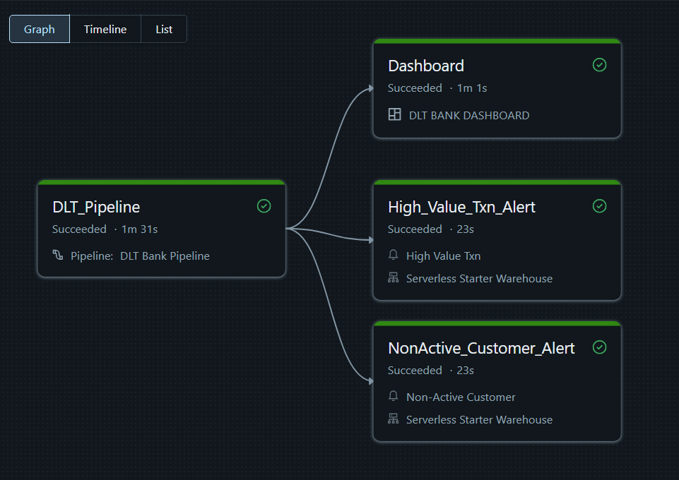
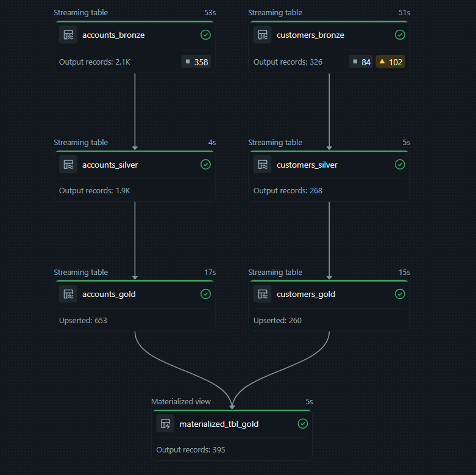
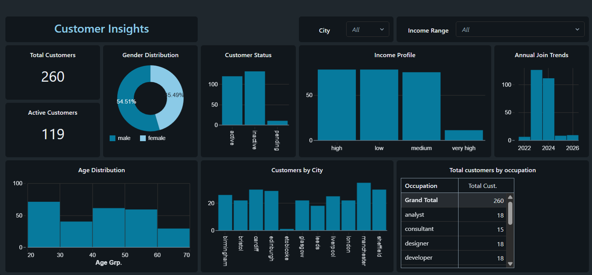
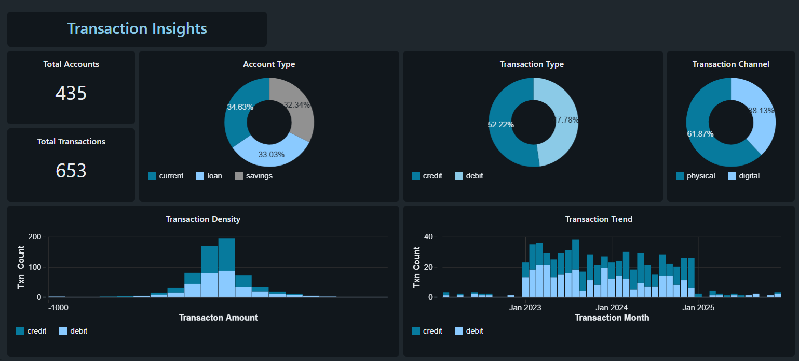

## **Stream Processing Pipeline Using Delta Live Tables**
 

### **Overview**
- This project demonstrates an end-to-end, production-grade data engineering project that transforms raw banking datasets (Customer Information and Account Transactions) into actionable financial insights.
- It is built using Databricks Delta Live Tables (DLT) & follows Medallion Architecture.
- The pipeline is fully governed by Unity Catalog, providing a secure and auditable path from raw ingestion to a final Transaction & Customer Insights Dashboard.

### **Tech Stack**
Databricks Delta Live Tables (DLT), PySpark, Spark SQL, Workflows (Jobs), Databricks SQL Dashboards.

### **Description**
1. Data Ingestion (Bronze Layer)
   - Ingested raw banking CSV files(accounts and customers data) from Databricks Volumes using Auto Loader for efficient & incremental data loading.
   - Implemented data quality checks using declarative expectations. It applies rules such as expect_or_fail for critical primary keys and expect_or_drop for invalid entries, ensuring only clean data moves downstream.
   - Removed duplicate rows & standardized string attributes by trimming whitespace and normalizing it to lowercase to ensure join consistency across datasets.

2. Transformation (Silver Layer)
    
   The Silver layer transforms the data into a high-quality, query-ready format by enforcing strict business logic and data integrity. Key transformations include:-
   - Data Normalization & Cleaning: Standardized categorical values for consistency, imputed missing entries with default labels, and applied regex-based validation to ensure all contact information follows industry-standard formats.
   - Filtering: Implemented rigorous logic to filter out invalid records.
   - Feature Engineering: Derived time-based attributes(Year, Month, Day) from transaction dates and calculated business-critical metrics like Customer Age and Account Tenure.

3. SCD Implementation (Gold Layer) 
   - Applied SCD Type 1 to customer table to maintain the most current status.
   - Applied SCD Type 2 to accounts table to track historical changes.
   - Created a Materialized View by joining cleaned Customer and Account table to provide a holistic view.

  
4. Automation & Orchestration
   - Scheduled Execution: The pipeline is orchestrated using Databricks Workflows, configured with a Daily Trigger.
   - Integrated Notifications: Automated notification triggers are set up to alert stakeholders via email immediately upon pipeline Success or Failure.

5. Monitoring, Alerts & Insights
   - Transaction & Customer Dashboards: Developed comprehensive Databricks SQL Dashboards visualizing:
        - Customer Insights: Gender distribution, age demographics, and city-wise customer density.
        - Transaction Insights: Monthly transaction trends, account type distributions (Current vs. Savings), and channel analysis (Digital vs. Physical).
        - Proactive Alerting: Implemented custom SQL Alerts (e.g., High_Value_Txn_Alert and NonActive_Customer_Alert) that monitor the Gold layer and trigger notifications when specific business thresholds are met.

  

